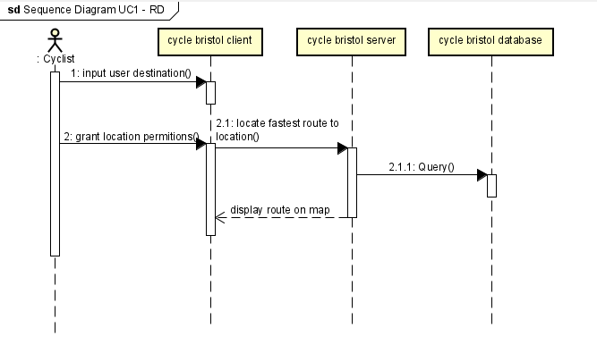

# Design
This page houses our wireframes and displays our use case behavioural design
## Behavioural design
<!---Place for all our designs including wire frames and sequence diagrams. Label your diagrams with which use case they are for along with your initials and follow up with a short description of what your design is depicting.

TODO: Describe a concrete scenario for each use-case. 
Describe it in terms of interactions between the components introduces above, and the actors introduced in your requirements.--->

Use Case 1: Fastest Route [R.D]

This diagram displays the steps taken in Use case 1 in a sequence diagram form. it starts with the users input of the destination and the granting of location permitions to be used by the server. the server then will route the fastest route to the destination by quereying the database and using any cycle paths from the database. which will display a route to the desired destination to the client. 
 

 

Use Case 2: Locational Data [C.A]

This is a sequence diagram dipicting how the process of getting the users geolocational data occurs over the different layers. Once location ppermitions are accepted gps data will be taken by the client which will locate them on the server and append the information to the database to refer back to. geolocation data will be returned to the client which will then be displayed on the map

## User Interface design

This context diagram though small shows 3 of the four use cases (use case 1, 3, 4) the second one cannot be properly shown as it causes a location request popup which varies from computer to computer. The homepage is the top left diagram and shows how other pages and the use cases lead into one another. The use cases can be easily accessed through three checkmarks in the collapseable sidebar 

UC1: By pressing on the small map icon under "fastest route" or by ticking the checkmark it takes you instantly to the fastest route page which plots the route as the closest thing to a straight line as possible

UC2: Whenever a map is accessed a location prompt will be sent out by the site which can be accepted or denied

UC3: From the homepage when a scenic route of the checkmark has been selected you will be taken to a page with landmarks or scenic areas that can be picked at which point itll use it as a middle destination.

UC4: When the "places of intrest" checkmark is ticked then you will be taken to the 
