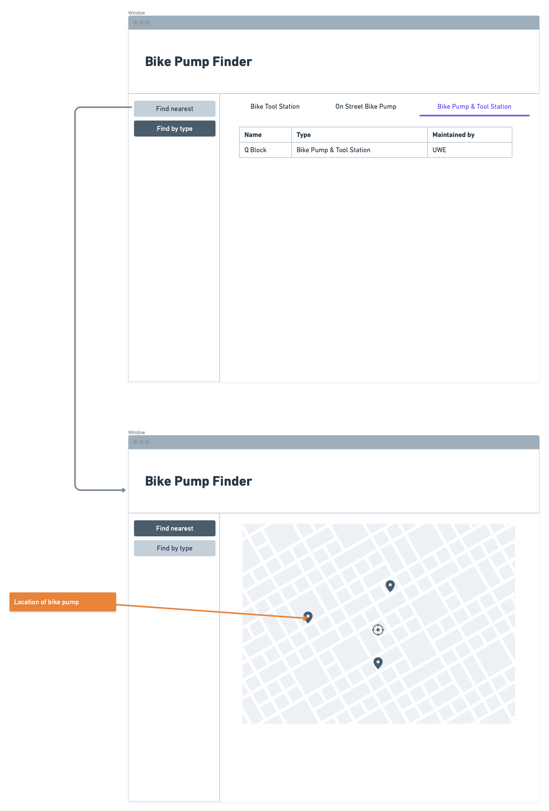

# Design

## Behavioural design
Place for all our designs including wire frames and sequence diagrams. Label your diagrams with which use case they are for along with your initials and follow up with a short description of what your design is depicting.

TODO: Describe a concrete scenario for each use-case. 
Describe it in terms of interactions between the components introduces above, and the actors introduced in your requirements.

This diagram displays the steps taken in Use case 1 in a sequence diagram form. it starts with the users input of the destination and the granting of location permitions to be used by the server. the server then will route the fastest route to the destination by quereying the database and using any cycle paths from the database. which will display a route to the desired destination to the client. 
 

 

Use Case 2: Locational Data [C.A]

This is a sequence diagram dipicting how the process of getting the users geolocational data occurs over the different layers. Once location ppermitions are accepted gps data will be taken by the client which will locate them on the server and append the information to the database to refer back to. geolocation data will be returned to the client which will then be displayed on the map

## User Interface design
TODO: Specify and develop a user interface mockup using a wireframe.

TODO: repeat as necessary
