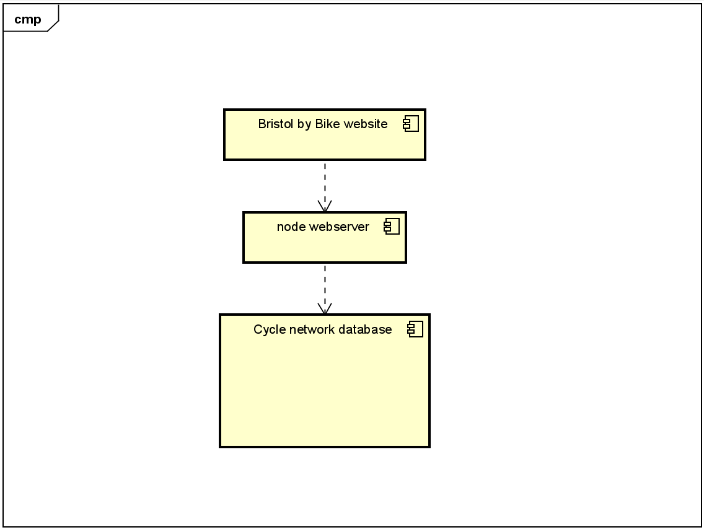

# Implementation

## Introduction
This is version v0.7 of a mapping application that will help cyclists navigate bristol using the [Cycle network](https://opendata.bristol.gov.uk/explore/dataset/cycle-network/map/?location=11,51.47784,-2.58227&basemap=jawg.streets) database containing __ rows of data; to map out cycle networks and display them in such a way that navigation can occur through the cycle network. There are __ outstanding issues.
<!---TODO: Describe the system implemented (Describe the dataset. Are there any known issues? Describe any configuration data).--->

<!--- how many layers (three tier system), using based on web, data setup--->
## Project Structure
the project folder structuring has been modeled below (generated with tree-cli).

├── docs\
├── html (contains html of website and css)\
├── node_modules (imported libraries)\
├── package-lock.json\
├── package.json (software configuration)\
├── readme.md\
└── server.js
<!--- TODO: Provide an outline of the project folder structure and the role of each file within it (not the contents of node_modules).
provide a table listing the number of jslint warnings/reports for each module.--->

<!--- TODO:do some eslint tests after converting html to ejs and add them here--->

## Software Architecture
This software hass a three tier service-oriented architecture. A MySQL database stores data of cycle routes. the web server Uses Node. The webpage is a HTML web-application.  
<!---TODO: Describe the major components of your architecture. Are any particular architectural styles being used?--->

 
