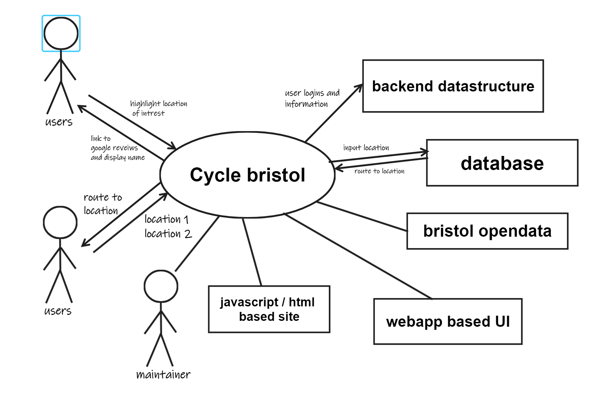

# Project Proposal
A cycle website app that will allow users to find the  fastest or more scienic routes to their desired locations. This app will also include places of interest.

<!---route with the lowest inclines--->

**Fastest Route:** 
This feature will allow users to find the fastest route to their destination to get there in the shortest possible time, it will however not take traffic and road closures into consideration. 

**Scenic Routes:** 
This feature will find scenic routes around Bristol for cyclists who wish to explore the nicer views that the city has to offer, as well as the more rural countryside routes. This will include displaying key view points that cyclists may wish to stop at along the route.

**Places of Interest:**  
This feature will display places of interest near to user's location, e.g museums, galleries, monuments.
<!--- 
Lowest Inclanes:
this feature will allow users to find the routes with lowest incline to their destination
 -->

## Business Case
<!--will people use it? is it financially viable? how do you implement it? --->

### Problem statement

### Business benefits
Cyclists will have the multiple options how to navigate around Bristol. 
This app will not only allow users to navigate around Bristol, it will also allow them to choose beetwen safer only cycle paths route or also a scenic routes which will be made to make the ride more pleasent and scenic for people who want to enjoy their ride. Users have the options to view places of interest around Bristol, which will benefit cyclist not only from Bristol but also cyclist visiting Bristol. 
This will also include an alert of potentional oncoming traffic. 

### Options Considered
- google maps
- bikemap
- cyclemap
- opencyclemap
- betterbybike

### Expected Risks
- IT security threats
- Target users dont want to use site
- unsustainable user growth
- scope creep
- poor UX design
- cross platform use 
- botched SEO
- bad optimisation 

## Project Scope
the site will have an interactive map which shows users how to manuver around the bristol area by bike and will highlight some key areas they may wish to visit areas can also be searched for, it will also display road names and public transport links as they may impact a cyclists journey.

this context diagram shows what external factors we expect the system will interact with or use 
