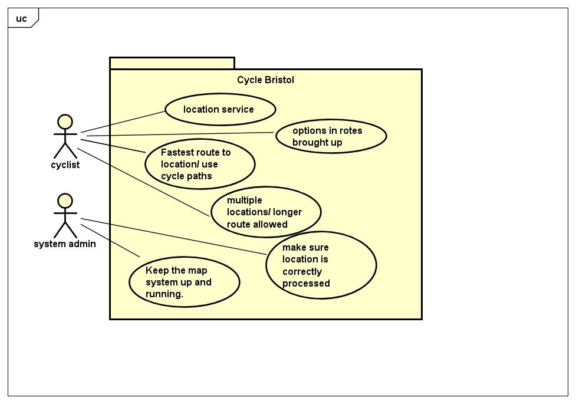

# Requirements

## User Needs

### User stories
* As a cyclist I want to get the fastest route from my location to my destination so that I can arrive somewhere on time

* As a cyclist I'd like to be able to take scenic routes to get to my destination so that I am able to enjoy the sights of the land
* As a cyclist id like to be able to get options in my routes so that I have options in case one route is compromised
* As a cyclist I want to be able to use cycle paths for my safety
* As a cyclist I want to see my location so that I know how far along the route I am.

<!---TODO: Write brief user stories to explain how various actors would interact with the system to accomplish a goal.
    Express these in the form from agile development:- As a (role) I want (goal) so that (benefit).--->

### Actors
* **Cyclist:** the main user of the application, they will be our core subject, they must ride a bike for pleasure, work or travel.

* **System admin:** responsible for the maintanence and upkeep of the map and website.
<!---TODO: List and describe the actors/users for this product.--->

### Use Cases
<!---TODO: Describe each use case (one per team member).
    Give each use case a unique ID, e.g. UC1, UC2, ...
    Summarise these using the use-case template below.--->

<!---Roland---> 
| USE-CASE ID: Roland | Determine Fastest route to location | 
| -------------------------------------- | ------------------- |
| **Description** | find the path that is closest to a straight line to the location |
| **Actors** | Cyclists |
| **Assumptions** | None</td></tr>
| **Steps** | 1)Get the location of the user 2)get the destination of the user 3) query database for routes 4)display how  |
| **Variations** | 1)get the begining location as an input of the user if location services unavaliable |
| **Non-functional** | 1)list one route as the main route. |
| **Issues** | none |
<!---Conner--->
| USE-CASE ID: Conner | Get the location data of the user | 
| -------------------------------------- | ------------------- |
| **Description** | Be able to give live location data on user with Wi-Fi connection. |
| **Actors** | Cyclist |
| **Assumptions** | Must have location enabled and access to the internet</td></tr>
| **Steps** | Cyclist enables access to their current locational data -> Mobile device's geolocational data is accessed -> Data sent to webpage/server -> Location marked on map. |
| **Variations** | None. |
| **Non-functional** | None. |
| **Issues** | How will this data be protected? |
<!---Michelle--->
| USE-CASE ID: Michelle | Display scenic routes | 
| -------------------------------------- | ------------------- |
| **Description** |Users have the option to choose more scenic routes. this can include a destination but is not necessery. this option can be used as just a day out cycling around Bristol with great views. 
| **Actors** |Cyclist| 
| **Assumptions** | Users want to choose a scenic route to either a destination or just a nice scenic route to look at.
| **Steps** | -**Option 1** :Live Location -> Scenic Routes -> Select Route -> Directions. -**Option 2**: -> Cycle Paths -> Sceneric Routes. -> Select Route -> Direction  |
| **Variations** | None. |
| **Non-functional** |- **Maintainability:** this feature requires a constant maintaince as possible road works might be in place and routes might not be accessable                                                               **-Realibility:** This feature might insure when destination choosen with a scenic route it is not only scenic but efficient and safe. |
| **Issues** |a scenic route not found to an specific destination.
 <!---If an user wishes to choose more scenic route to a specific destination. an option might not always be available to them.--->
  |
<!---Ibrahim--->
| USE-CASE ID: Ibrahim | Cycle paths routes | 
| -------------------------------------- | ------------------- |
| **Description** | TODO: Goal to be achieved by use case and sources for requirement |
| **Actors** | TODO: List of actors involved in use case |
| **Assumptions** | TODO: Pre/post-conditions if any</td></tr>
| **Steps** | TODO: Interactions between actors and system necessary to achieve goal |
| **Variations** | TODO: OPTIONAL - Any variations in the steps of a use case |
| **Non-functional** | TODO: OPTIONAL - List of non-functional requirements that the use case must meet. |
| **Issues** | TODO: OPTIONAL - List of issues that remain to be resolved |

<!-- TODO: Your Use-Case diagram should include all use-cases. -->

## Software Requirements Specification
### Functional requirements

<!---TODO: create a list of functional requirements. 
    e.g. "The system shall ..."
    Give each functional requirement a unique ID. e.g. FR1, FR2, ...
   Indicate which UC the requirement comes from.--->
* **FR1)** The system must get user location or user inputed start location if location services off.
* **FR2)** The system must query for straightest route to end location using the cycle network database
* **FR3)** The system must display route to end location using map displayed

### Non-Functional Requirements
### Maintability
* **NFR1**: The software development process will use unit-testing. (all use-cases)
### Efficiency
* **NFR2**: The software client will be lightweiht such that it loads in under 1 second on a typical broadband line (>1 mbps).(all use cases)
### Portability
* **NFR3**: The software must be written so as to be cross-platform, running on IOS (>v10) and Android (>v5).
### Accesebility 
* **NFR4**: The software must have a screen-reader for being unable to view the content. (must read out the screen content).
### Extensibility
* **NFR5**: The software shall be extenable. must have a lightweight software framework which allows changes 
